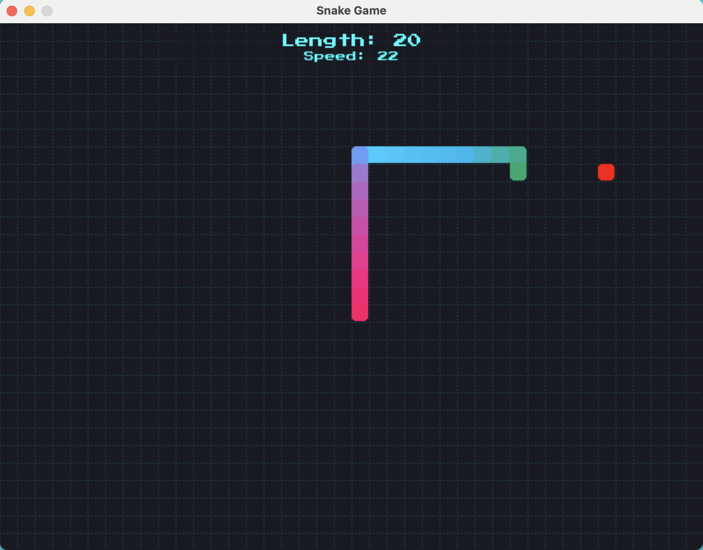

# Python Snake Game

> **Note**: The entire codebase was created using an AI code editor ([TRAE AI](https://www.trae.ai/)) as an experiment. This README was generated with the assistance of AI.

🕹️ Try final game at:  https://igaster.github.io/python-snake/



## Overview
A modern implementation of the classic Snake game built with Python and Pygame, featuring smooth controls, progressive difficulty, and dynamic color effects.

## Technology Stack

### Core Game Implementation
- **Python 3.x** - Core programming language
- **Pygame** - Game development library
- **Press Start 2P Font** - Retro-style game font

### Web Deployment Stack
- **Pygbag** - Python/Pygame to WebAssembly compiler
- **WebAssembly (Wasm)** - Binary instruction format for stack-based virtual machine
- **HTML5 Canvas** - Web rendering of the game
- **GitHub Actions** - CI/CD pipeline for automated deployment
- **GitHub Pages** - Web hosting platform

## Features
- Smooth snake movement with grid-based mechanics
- Progressive difficulty system
- Dynamic color-cycling snake body
- Score tracking system
- Collision detection
- Game over and restart functionality

## Configuration
- Window Resolution: 800x600 pixels
- Grid Size: 20x20 pixels
- Frame Rate: 60 FPS

## Installation

### Local Development
1. Ensure Python 3.x is installed
2. Install dependencies:
   ```bash
   pip install pygame
   ```
3. Run the game:
   ```bash
   python main.py
   ```

### Web Version
The game is also playable directly in web browsers at the project's GitHub Pages URL.

## Development

### Project Structure
```
├── assets/
│   └── fonts/          # Game fonts
├── game.py             # Core game logic
├── main.py            # Game entry point
├── test_game.py       # Game tests
└── index.html         # Web version entry point
```

## License
This project is open source and available under the MIT License.
